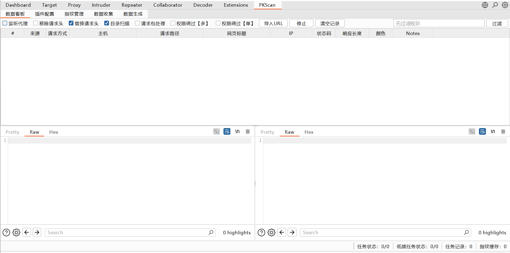
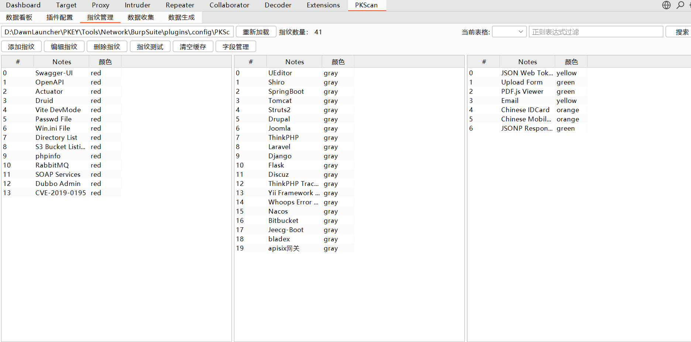
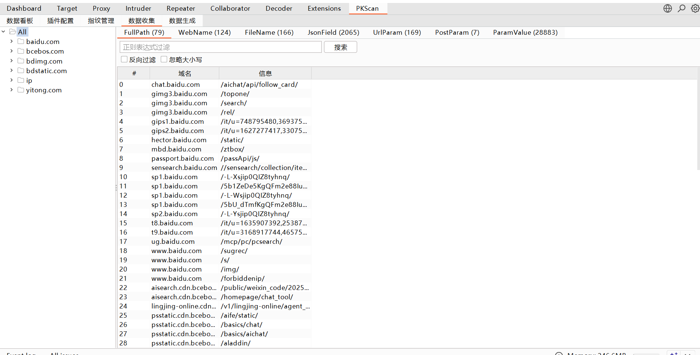
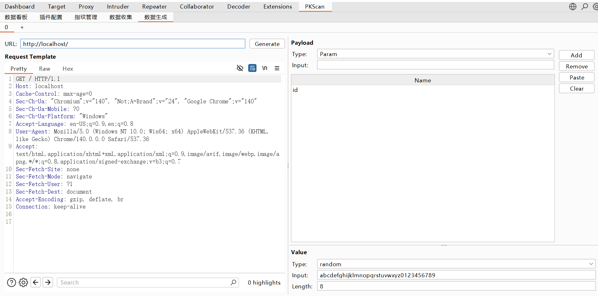

郑重声明：文中所涉及的技术、思路和工具仅供以安全为目的的学习交流使用，任何人不得将其用于非法用途以及盈利等目的，否则后果自行承担。
# 介绍
作者：PYJ

定位：在攻防和渗透测试中，基于WEB模糊测试技术的具体实现，帮助白帽子更好的发现隐藏的安全隐患，让你总能快人一步~

语言：Java 8+

功能：递归目录扫描、权限绕过、403 Bypass、指纹识别、数据采集、数据生成。

PS. 从一开始通过key神的讲解再到博客的阅读，最后在实际渗透测试中的应用，让我理解了什么是WebFuzz，模糊测试这一概念，如果你也是刚刚接触，不理解这种笼统的概念，那么不妨使用看看我的这一项目，相信它能帮你更好的理解，并能在后续的实践中让你收获颇多。最后，如果有什么好的建议或是想法，再或者是Bug，欢迎提issus，虽然我不一定能解决，哈哈，共勉~

# 功能

1. 递归目录扫描、权限绕过、403 Bypass

2. 指纹识别

2. 数据采集

3. 数据生成

# 致谢
[vaycore/OneScan: OneScan 是一款用于递归目录扫描的 BurpSuite 插件](https://github.com/vaycore/OneScan)

[0x727/BypassPro: 对权限绕过自动化bypass的burpsuite插件](https://github.com/0x727/BypassPro)

[gh0stkey/HaE: HaE - Highlighter and Extractor, Empower ethical hacker for efficient operations.](https://github.com/gh0stkey/HaE)

[Chen's Blog](https://gh0st.cn/)

[gh0stkey/CaA: CaA - Collector and Analyzer, Insight into information, exploring with intelligence in a thousand ways.](https://github.com/gh0stkey/CaA)
